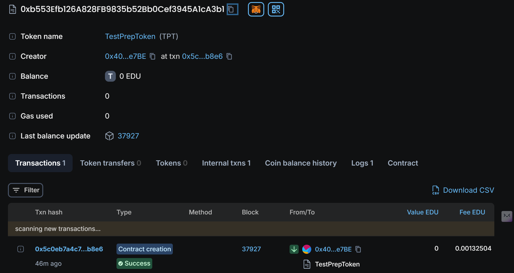

# 🎓 TestPrepToken - Decentralized Test Prep Reward System

## Test Score Reward


## 🛠️ Vision

The vision of **TestPrepToken** is to create a decentralized ecosystem that rewards students for their academic efforts, promoting transparency, fairness, and engagement in test preparation. This platform encourages students to strive for academic success while being rewarded with cryptocurrency tokens based on their performance, incentivizing learning and participation in educational assessments.

## 🔑 Project Features

- **ERC-20 Token Standard**: Implements an ERC-20 standard token named `TestPrepToken (TPT)`.
- **Ownership Control**: Only the contract owner can record student scores and reward tokens, ensuring controlled minting.
- **Decentralized Reward System**: Rewards students with `TPT` tokens proportional to their test scores, fostering a competitive and motivational environment.
- **Score Tracking**: Keeps track of student scores on the blockchain, ensuring transparent and immutable records.
- **Public Accessibility**: Anyone can view students' scores and verify rewards on the blockchain.
- **Event Logging**: Emits a `TokensRewarded` event every time tokens are rewarded to students, improving transparency.

## 🌟 Future Scope

- **Student Account Management**: Develop a decentralized app (dApp) allowing students to log in and track their scores, tokens, and performance over time.
- **Leaderboard Integration**: Introduce a leaderboard to showcase top-performing students and their earned tokens.
- **Multi-Owner Functionality**: Add functionality to allow multiple owners or administrators to record student scores.
- **Cross-Platform Integration**: Integrate with online learning platforms (e.g., Coursera, Khan Academy) for automatic score tracking and token rewards.
- **Marketplace**: Create a marketplace where students can spend `TPT` tokens on learning materials, courses, or tutoring services.

## 🏗️ Project Structure

```bash
├── contracts              # Smart contracts folder
│   └── TestPrepToken.sol   # Main token contract
├── migrations             # Migration scripts to deploy contracts
│   └── 2_deploy_contracts.js
├── test                   # Unit tests for smart contract functionality
│   └── TestPrepToken.test.js
├── README.md              # Project documentation
├── truffle-config.js      # Truffle configuration file
└── package.json           # Project dependencies and scripts

## Developer Details

Name: Alok
Contact: iitianalok2709@gmail.com 

## Deployment
Chain Name:  Educhain open campus
Contract Id:
0xb553Efb126A828FB9835b52Bb0Cef3945A1cA3b1



